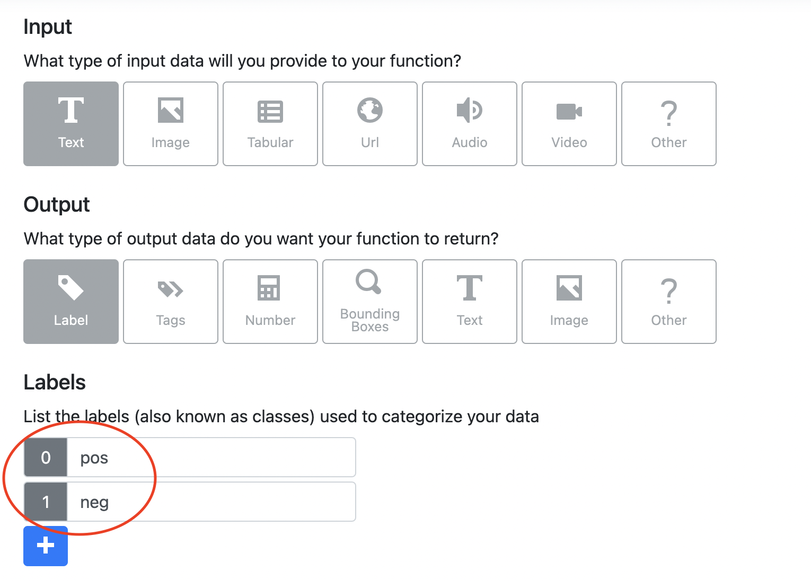
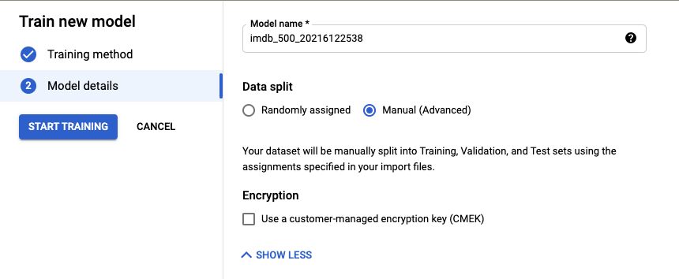
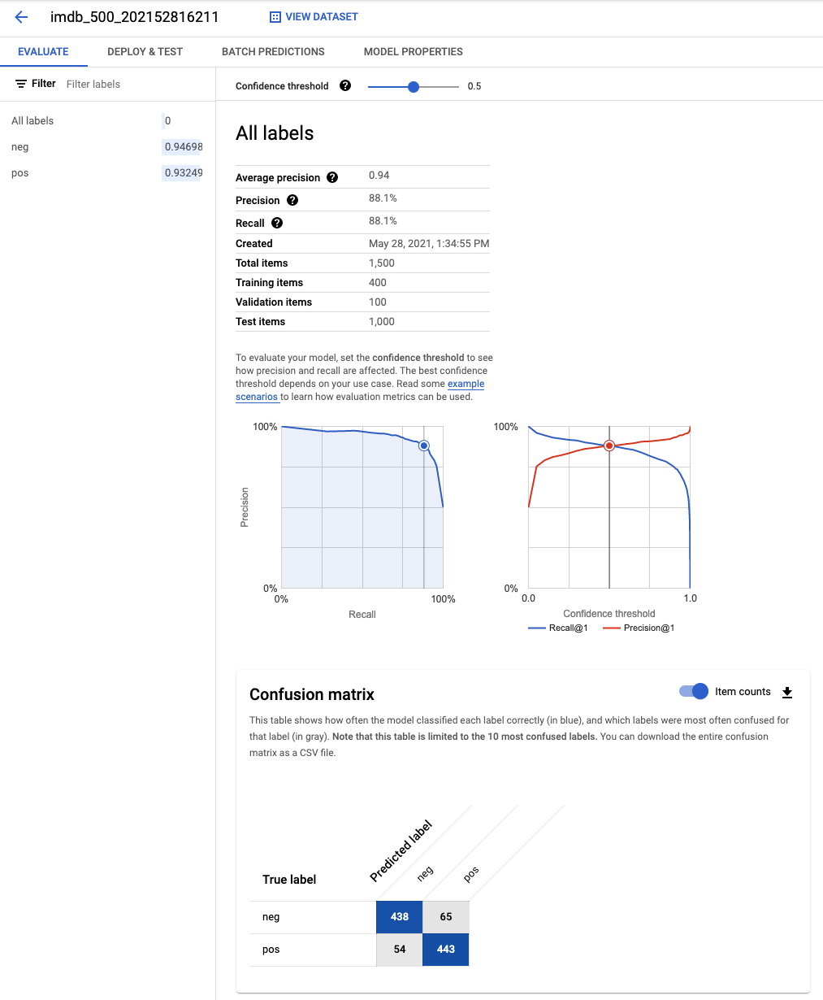

# Code samples for AutoML blogpost

https://medium.com/nyckelai/automl-benchmark-nyckel-vs-google-vs-huggingface-1cc0649ef27d

## Setup

NOTE: This code is only tested on `python3.9`

### Create python environment

* Install `python3.9`.
* Clone this repository.
* Go to `automl_benchmark` folder.
* Create a python virtual environment. For example say:

```bash
python3.9 -m venv automl_benchmark_env
source automl_benchmark_env/bin/activate
```

* Install requirements like so `pip install -r requirements.txt`.
* Install autonlp like so: `pip install autonlp==0.2.6 --no-dependencies`.

### Prepare data files

To download the data files and prepare `.csv` files run `prepare_data.py` like so

```bash
python prepare_data.py --dataset_name imdb --n_train 500
```

This generates five `.csv` file in this folder.

```bash
Filename                    | Details
---------------------------------------------------------------------
imdb_train_500.csv          | train data (400 samples)
imdb_val_500.csv            | validation data (100 samples)
imdb_trainval_500.csv       | train and validation data (500 samples)
imdb_test.csv               | test data (1000 samples)
imdb_all_500.csv            | train, val and test data (1500 samples)
```

All `.csv` files are formatted like so:

```bash
split_name, text, label_name
```

## Nyckel

### Training using the UI

Create a new function at nyckel.com and follow the instructions. For the `IMDB` dataset name your labels `pos` and `neg`. Like so:



At the import step choose `imdb_trainval_500.csv` and select columns corresponding to text and labels.

### Training using the API

To train using the API first setup a function using the UI as instructed above. Then navigate to the `API` page of the function you just created and copy the `client_id` and `client_secret`. Create environment variables like so:

```bash
export NYCKEL_CLIENT_ID=<Your client ID>
export NYCKEL_CLIENT_SECRET=<Your client secret>
```

Then run

```bash
python nyckel.py train imdb 500
```

to create a new function using the API. Copy the function id printed by the console.

### Evaluate performance

Setup your environment variables like above, then run

```bash
python nyckel.py evaluate <your_function_id> imdb_test.csv
```

## Huggingface

### Training using the CLI

Create a Huggingface AutoNLP account. Copy API key to environment varilable like so

```bash
export HF_API_KEY=<your API key>
```

To train run

```bash
python huggingface.py train imdb 500
```

You will have to accept the ~$15 charge. Then run

```bash
python huggingface.py monitor imdb_500
```

to check the progress of your training. Once complete select the model which does best on the validation set.

### Evaluate performance

Run

```bash
python huggingface.py evaluate imdb_500 <your_selected_model_id> imdb_test.csv
```

to evaluate your selected model on the imdb test set.

## Google Vertex AI

### Train a model

We use the Google GCP UI to train the models. The steps are as follows:

* Use the Google GCP console to create an account.
* Create a new dataset and select the `imdb_all_500.csv` file.
* Train a model based on the selected dataset. Use the "Manual (advanced) option for data splits".



### Evaluate performance

Since we upload the test data we can read out the test set performance from the console. Simply add the CM diagonal and divide by 1000. In this example: `(438 + 443) / 1000 = 88.1%`.



Alternatively, create a deploy endpoint using the UI, set `GCP_BEARER_TOKEN` and `GCP_INVOKE_ENDPOINT` env. variables and run.

```bash
python google.py evaluate imdb_test.csv
```
